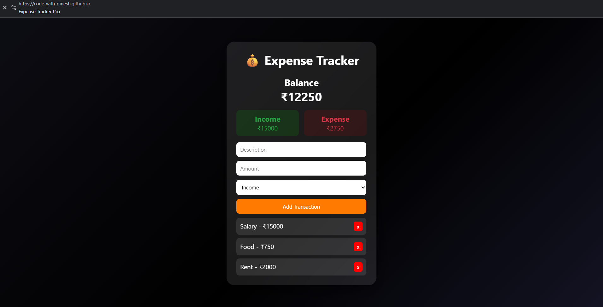

# 💰 Expense Tracker Pro

A professional Expense Tracker application built using HTML, CSS, and JavaScript.

## 🚀 Features
- Add income and expense transactions
- Automatic balance calculation
- Separate income and expense tracking
- Delete transactions
- Data stored using Local Storage
- Modern animated UI with glassmorphism design

## 🧠 How It Works
- Users can add transactions with type (income/expense)
- The app calculates:
  - Total Income
  - Total Expense
  - Remaining Balance
- Data is stored in browser local storage for persistence

## 🛠️ Tech Stack
- HTML
- CSS (Animations + Glass UI)
- JavaScript (DOM, Local Storage)

## 📸 Preview

## 🌐 Live Demo
(https://code-with-dinesh.github.io/day-6-expense-tracker-pro/)
